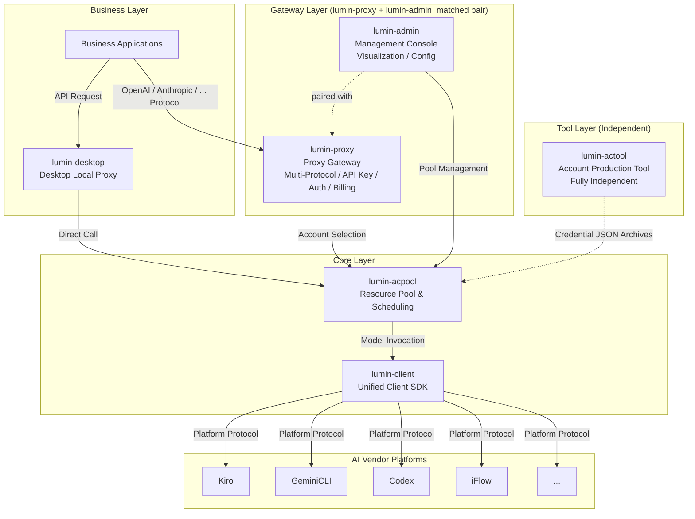
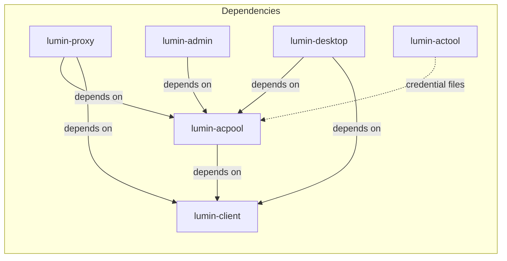

English | [中文](./docs/README_zh_CN.md)

## LUMIN

Light up AI routing. Hide the complexity.

---

### Introduction

**LUMIN** is a lightweight, unified AI proxy SDK ecosystem designed for multi-platform model invocation, account pool management, and intelligent routing.

It uniformly encapsulates and hides the protocol differences of various AI platforms such as **Kiro**, **GeminiCLI**, **Codex**, **iFlow**, etc., providing a consistent, concise, and stable calling interface. This allows upper-layer businesses to focus on their core logic without caring about the underlying platform details — perfectly embodying the core concept of **"Cloud Hiding"**: hide complexity at the bottom, leave simplicity for the business.

---

### LUMIN Ecosystem Overview

The LUMIN project consists of multiple sub-projects, each responsible for a specific domain, working together to form a complete AI proxy gateway system:

| Sub-Project | Role | Description |
|---|---|---|
| **lumin-client** | Client SDK | Core library for interfacing with various AI vendor platforms; provides unified request/response format conversion, usage rule parsing, and credential management interface definitions |
| **lumin-acpool** | Resource Pool Service | Core library for unified resource management, intelligent scheduling, availability assurance, and account allocation |
| **lumin-proxy** | Proxy Gateway | Business-layer proxy gateway supporting **multiple mainstream model protocols** (OpenAI, Anthropic, etc.), allowing users to call models via various standard protocols; also handles API key management, authentication, billing, and request forwarding; **works in tandem with lumin-admin** as a matched pair |
| **lumin-admin** | Admin Web Service | Web-based management console for account pool visualization, business API key management, user management, billing policies, and token top-up; **works in tandem with lumin-proxy** as a matched pair |
| **lumin-actool** | Account Production Tool | A fully **independent** CLI tool (no dependency on any other LUMIN sub-project) that produces account credential files across various AI vendor channels; outputs compressed archives of credential JSON files, which are then imported into lumin-acpool to ensure a steady supply of available accounts |
| **lumin-desktop** | Desktop Application | Local desktop proxy client built on lumin-client and lumin-acpool, providing standalone local proxy capabilities; serves as an alternative to lumin-proxy — users choose one or the other |

---

### Overall Architecture



---

### Sub-Project Relationships



- **lumin-client** is the foundational layer, depended on by all other sub-projects. It defines the `Provider` interface, `Credential` interface, unified `Request`/`Response` models, and platform-specific converters (Kiro, GeminiCLI, Codex, iFlow, etc.).
- **lumin-acpool** depends on lumin-client. It uses lumin-client's `Provider` for health checks and usage rule fetching, while itself handling credential management, credential validation, and resource pool scheduling capabilities on top.
- **lumin-proxy** and **lumin-admin** are a **matched pair** designed to work together: lumin-proxy serves as the user-facing proxy gateway for model requests, supporting **multiple mainstream model protocols** (OpenAI, Anthropic, etc.) so that users can call models via their preferred standard protocol; it also handles API key management, authentication, billing, and request forwarding. lumin-admin serves as the management backend for operations and configuration. lumin-proxy depends on both lumin-acpool and lumin-client; lumin-admin depends on lumin-acpool.
- **lumin-desktop** depends on lumin-acpool and lumin-client, implementing a standalone local desktop proxy client. It serves as a local alternative to lumin-proxy — users choose either the cloud-based lumin-proxy or the local lumin-desktop for their AI proxy needs.
- **lumin-actool** is a **fully independent** tool with no dependency on any other LUMIN sub-project. It is solely responsible for producing account credential files — outputting compressed archives of credential JSON files. These credential archives are then imported into lumin-acpool, ensuring the resource pool always has a steady supply of available accounts.

---

### About This Project: lumin-client

**lumin-client** is the **unified AI client SDK** of the LUMIN ecosystem. As the most foundational core library, it is responsible for:

- **Unified model invocation**: Provides consistent `GenerateContent` / `GenerateContentStream` interfaces, shielding all AI vendor protocol differences
- **Multi-platform adaptation**: Built-in adapters for Kiro, GeminiCLI, Codex, iFlow and more, with extensible architecture for new platforms
- **Unified data models**: Defines standard `Request`, `Response`, `Message`, `ToolCall` models; all platform data is converted to and from this unified format
- **Credential interface**: Defines the `Credential` interface for authentication, token refresh, expiration detection, and availability checking
- **Usage rule parsing**: Defines `UsageRule` / `UsageStats` models, supports time-window-based multi-granularity usage limit parsing (minute/hour/day/week/month)
- **Streaming response support**: Provides `Consumer[*Response]` streaming queue and `ResponseAccumulator` for chunk-by-chunk accumulation
- **HTTP error normalization**: Normalizes all vendor HTTP errors into a unified `HTTPError` type with semantic error codes (BadRequest/Unauthorized/Forbidden/RateLimit/ServerError)
- **Token counting**: Provides `TokenCounter` interface and simple heuristic + tiktoken-based implementations
- **Multimodal support**: Message model supports text, image, audio, and file content types

#### lumin-client Internal Architecture

```mermaid
graph TB
    subgraph "Provider Layer — Platform Adapters"
        PI[Provider Interface<br/>Model + CredentialManager + UsageLimiter]
        KIRO_P[Kiro Provider]
        GEM_P[GeminiCLI Provider]
        CODEX_P[Codex Provider]
        IFLOW_P[iFlow Provider]
        REG[Provider Registry<br/>Register / GetProvider]
    end

    subgraph "Converter Layer — Protocol Conversion"
        subgraph "Request Builder"
            RB[ReqBuilder<br/>Unified Request → Platform Request]
            SPB[SystemPromptBuilder]
            HB[HistoryBuilder]
            CMB[CurrentMessageBuilder]
            TB[ToolsBuilder]
            PPB[PreprocessBuilder]
        end
        subgraph "Response Parser"
            RP[RespParser<br/>Platform Response → Unified Response]
            ARP[AssistantResponseParser]
            CCP[CompletionChunkParser]
            TCP[ToolCallRequestParser]
            EP[ErrorParser]
            MP[MeteringParser]
        end
    end

    subgraph "Unified Model Layer — Data Models"
        REQ[Request<br/>Model / Messages / GenerationConfig / Tools]
        RSP[Response<br/>Choices / Usage / Error / Done]
        MSG[Message<br/>Role / Content / ContentParts / ToolCalls]
        TC[ToolCall<br/>Function / Arguments / ID]
        ACC[ResponseAccumulator<br/>Streaming Chunk Aggregation]
    end

    subgraph "Credential Layer"
        CI[Credential Interface<br/>AccessToken / RefreshToken / Expiry]
        CS[CredentialStatus<br/>Available / Expired / Invalidated / Banned]
    end

    subgraph "Usage Rule Layer"
        UR[UsageRule<br/>SourceType / TimeGranularity / WindowSize / Total]
        US[UsageStats<br/>Used / Remain / StartTime / EndTime]
    end

    subgraph "Infrastructure Layer"
        HC[HTTPClient<br/>Middleware-based HTTP Client]
        MW[LoggingMiddleware<br/>Request/Response Logging]
        HE[HTTPError<br/>Normalized Error Types]
        TK[TokenCounter<br/>Simple + Tiktoken]
        Q[Queue<br/>Consumer / Producer]
        MP2[MemPool / TaskPool<br/>Memory & Task Pools]
    end

    %% Provider implements interface
    KIRO_P --> PI
    GEM_P --> PI
    CODEX_P --> PI
    IFLOW_P --> PI
    PI --> REG

    %% Provider uses converter
    KIRO_P --> RB
    KIRO_P --> RP
    GEM_P --> RB
    GEM_P --> RP
    CODEX_P --> RB
    CODEX_P --> RP
    IFLOW_P --> RB
    IFLOW_P --> RP

    %% ReqBuilder sub-builders
    RB --> SPB
    RB --> HB
    RB --> CMB
    RB --> TB
    RB --> PPB

    %% RespParser sub-parsers
    RP --> ARP
    RP --> CCP
    RP --> TCP
    RP --> EP
    RP --> MP

    %% Provider uses unified models
    PI --> REQ
    PI --> RSP
    PI --> MSG
    PI --> CI
    PI --> UR

    %% Streaming support
    RSP --> ACC
    RSP --> Q

    %% Infrastructure
    PI --> HC
    HC --> MW
    HC --> HE
    PI --> TK

```



**Provider Invocation Flow**:
```
Caller
  │
  ├─ Build unified Request (Messages + GenerationConfig + Tools)
  │
  ├─ Provider.GenerateContent(ctx, credential, request)
  │     │
  │     ├─ ReqBuilder: Unified Request → Platform-specific Request
  │     ├─ HTTPClient: Send HTTP request (with middleware pipeline)
  │     ├─ RespParser: Platform-specific Response → Unified Response
  │     └─ return *Response
  │
  └─ Provider.GenerateContentStream(ctx, credential, request)
        │
        ├─ ReqBuilder: Unified Request → Platform-specific Request
        ├─ HTTPClient: Send HTTP request (streaming)
        ├─ RespParser: Parse SSE/EventStream chunks → Unified Response chunks
        └─ return Consumer[*Response]  (streaming queue)
```

#### Core Modules

| Module | Location | Description |
|---|---|---|
| **Provider** | `providers/interface.go` | Top-level interface combining `Model`, `CredentialManager`, and `UsageLimiter`; each platform implements this interface |
| **Kiro Provider** | `providers/kiro/` | Kiro platform adapter with event-stream-based request/response converter (Builder/Parser pattern) |
| **GeminiCLI Provider** | `providers/geminicli/` | GeminiCLI platform adapter |
| **Codex Provider** | `providers/codex/` | Codex platform adapter |
| **iFlow Provider** | `providers/iflow/` | iFlow platform adapter |
| **Converter (Builder)** | `providers/kiro/converter/builder/` | Converts unified `Request` to platform-specific request format; modular builders for system prompt, history, current message, tools, and preprocessing |
| **Converter (Parser)** | `providers/kiro/converter/parser/` | Parses platform-specific response events into unified `Response`; registry-based event parser dispatching |
| **Request / Response** | `providers/request.go`, `providers/response.go` | Unified data models for all platforms: `Request`, `Response`, `Choice`, `Usage` |
| **Message** | `providers/message.go` | Unified message model supporting text, image, audio, file multimodal content and tool calls |
| **ToolCall** | `providers/tool_call.go` | Tool call model with function definition, arguments, and extra fields for provider-specific passthrough |
| **ResponseAccumulator** | `providers/accumulator.go` | Streaming chunk accumulator following the openai-go `ChatCompletionAccumulator` pattern; supports `JustFinishedContent()` / `JustFinishedToolCall()` event detection |
| **Credential** | `credentials/` | Credential interface (`AccessToken`, `RefreshToken`, `Expiry`, `UserInfo`) and status enumeration (`Available`, `Expired`, `Invalidated`, `Banned`, `UsageLimited`, `ReauthRequired`) |
| **UsageRule** | `usagerule/` | Usage rule model with time-window-based multi-granularity quota definitions (minute/hour/day/week/month) and usage statistics |
| **HTTPClient** | `httpclient/` | Middleware-based HTTP client (onion model); built-in `LoggingMiddleware` for request/response logging |
| **HTTPError** | `providers/http_errors.go` | Normalized HTTP error type with semantic error codes: `BadRequest(400)`, `Unauthorized(401)`, `Forbidden(403)`, `RateLimit(429)`, `ServerError(500)`, plus `CooldownUntil` for rate limit recovery |
| **TokenCounter** | `providers/token_conter.go` | Token counting interface with `SimpleTokenCounter` (rune heuristic) and tiktoken-based implementation |
| **Queue** | `queue/` | Generic `Consumer[T]` / `Producer[T]` / `Queue[T]` interfaces for streaming response delivery |
| **Pool** | `pool/` | Memory pool (`mempool`) and task pool (`taskpool`) for resource reuse and concurrent task execution |
| **Provider Registry** | `providers/register.go` | Global provider registry supporting `Register()` and `GetProvider(type, name)` lookups |
| **CLI Tool** | `cli/` | Command-line tool for credential management, token refresh, usage query, and test data generation |

#### Credential Status Lifecycle

```
 ┌─────────────────────┐
 │     Available        │ ◄─── Refresh success
 │  (normal operation)  │ ◄─── Recovery
 └────────┬──┬──┬───────┘
          │  │  │
          │  │  │ Token expired
          │  │  ▼
          │  │ ┌──────────────┐
          │  │ │   Expired     │──► Refresh() ──► Available
          │  │ │  (can refresh)│──► Refresh() ──► Invalidated (if refresh_token invalid)
          │  │ └──────────────┘
          │  │
          │  │ Usage limit triggered
          │  ▼
          │ ┌──────────────────┐
          │ │  UsageLimited     │──► Wait for window reset ──► Available
          │ └──────────────────┘
          │
          │ Platform banned / Forbidden
          ▼
 ┌──────────────┐     ┌──────────────────┐
 │   Banned      │     │  Invalidated      │
 │ (manual fix)  │     │  (permanent)      │
 └──────────────┘     └──────────────────┘

         ┌──────────────────┐
         │ ReauthRequired    │──► User re-authorization ──► Available
         │ (human action)    │
         └──────────────────┘
```

---

### Technical Features

- Written in pure **Golang**, high performance, low memory footprint
- Used as an **SDK library** — no intermediate service dependencies, simple deployment
- **Extensible architecture** — adding new AI platform support only requires implementing the `Provider` interface
- **Middleware-based HTTP client** — onion model for flexible request/response interception
- **Normalized error handling** — all vendor errors converted to semantic `HTTPError` types
- **Streaming first** — native streaming support with `Consumer[*Response]` queue and `ResponseAccumulator`
- **Multimodal ready** — supports text, image, audio, and file content in messages
- Provides **CLI tool** for credential management and usage inspection
- Simple configuration, concise API design

---

### Project Positioning

**LUMIN = Cloud Hiding · Unified AI Proxy Gateway**

Let businesses focus only on logic, not platforms; let complexity be hidden, and calls be simpler.
