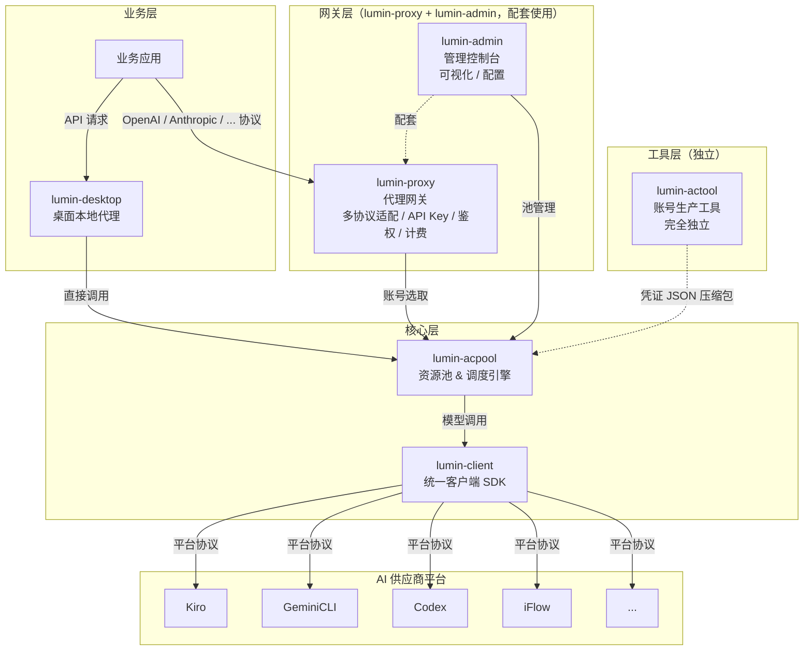
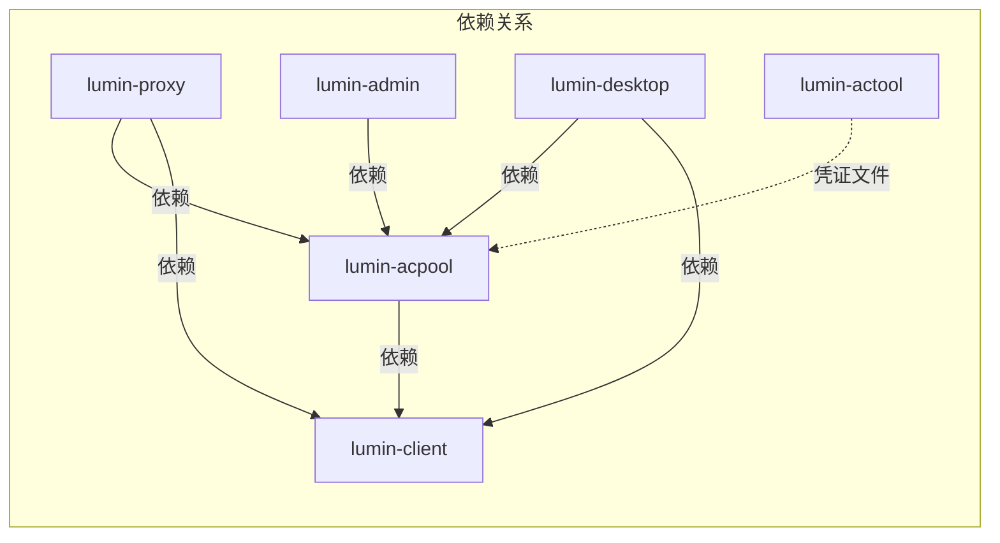

[English](../README.md) | 中文

## LUMIN

点亮智能路由，隐藏底层复杂。

Light up AI routing. Hide the complexity.

---

### 简介

**LUMIN** 是一套轻量级、统一的 AI 代理 SDK 生态系统，专为多平台模型调用、账号池管理与智能路由设计。

它将 **Kiro**、**GeminiCLI**、**Codex**、**iFlow** 等不同 AI 平台的协议差异统一封装、完全隐藏，对外提供一致、简洁、稳定的调用接口，让上层业务无需关心底层平台细节——完美契合 **"云隐"** 核心理念：把复杂藏在底层，把简单留给业务。

---

### LUMIN 生态全景

LUMIN 项目由多个子项目组成，每个子项目各司其职，协同构成完整的 AI 代理网关系统：

| 子项目 | 定位 | 描述 |
|---|---|---|
| **lumin-client** | 客户端 SDK | 核心基础库，负责封装与各 AI 供应商平台的接口，提供统一的请求/响应格式转换、用量规则解析、凭证管理接口定义 |
| **lumin-acpool** | 资源池服务 | 核心调度库，负责资源的统一管理、智能调度、可用性保证和账号分配 |
| **lumin-proxy** | 代理网关 | 业务层代理网关，支持**多种主流模型协议**（OpenAI、Anthropic 等），用户可按多种标准协议调用模型；同时负责 API Key 管理、鉴权、计费和请求转发；**与 lumin-admin 配套使用** |
| **lumin-admin** | 管理 Web 服务 | Web 可视化管理控制台，负责账号池可视化管理、业务 API Key 管理、用户管理、计费策略、Token 充值等；**与 lumin-proxy 配套使用** |
| **lumin-actool** | 账号生产工具 | **完全独立**的 CLI 工具（不依赖任何其他 LUMIN 子项目），负责各渠道供应商账号凭证的批量生产，产出多个凭证 JSON 文件的压缩包，再导入 lumin-acpool 以确保资源池始终拥有充足的可用账号 |
| **lumin-desktop** | 本地客户端代理应用 | 基于 lumin-client 和 lumin-acpool 开发的桌面级本地代理客户端应用，提供独立的本地代理能力；与 lumin-proxy 二选一，用户可选择云端代理或本地代理 |

---

### 整体架构设计



---

### 子项目依赖关系



- **lumin-client** 是最底层的基础库，被其他所有子项目依赖。它定义了 `Provider` 接口、`Credential` 凭证接口、统一的 `Request`/`Response` 消息模型，以及各平台特有的协议转换器（Kiro、GeminiCLI、Codex、iFlow 等）。
- **lumin-acpool** 依赖 lumin-client，利用其 `Provider` 进行健康检查、用量规则获取，同时自身负责凭证管理与凭证校验，并在此基础上提供资源池调度能力。
- **lumin-proxy** 和 **lumin-admin** 是 **配套使用** 的一对组合：lumin-proxy 作为面向用户的代理网关，支持**多种主流模型协议**（OpenAI、Anthropic 等），用户可以按自己习惯的标准协议来调用模型；同时负责 API Key 管理、鉴权、计费、请求转发。lumin-admin 作为运维管理后台，负责可视化管理和系统配置。lumin-proxy 依赖 lumin-acpool 和 lumin-client；lumin-admin 依赖 lumin-acpool。
- **lumin-desktop** 依赖 lumin-acpool 和 lumin-client，实现独立的桌面级本地代理客户端应用。它与 lumin-proxy 的关系是 **二选一**：用户可以选择通过云端的 lumin-proxy 进行代理访问，也可以选择通过本地的 lumin-desktop 进行代理访问，两者在功能定位上互为替代方案。
- **lumin-actool** 是一个**完全独立**的工具，不依赖任何其他 LUMIN 子项目。它只负责生产账号凭证文件——产出多个凭证 JSON 文件的压缩包。这些凭证压缩包随后被导入 lumin-acpool，为资源池源源不断地供给可用账号。

---

### 关于本项目：lumin-client

**lumin-client** 是 LUMIN 生态中的 **统一 AI 客户端 SDK**。作为最底层的核心基础库，它负责：

- **统一模型调用**：提供一致的 `GenerateContent` / `GenerateContentStream` 接口，屏蔽所有 AI 供应商的协议差异
- **多平台适配**：内置 Kiro、GeminiCLI、Codex、iFlow 等平台适配器，可扩展架构支持快速接入新平台
- **统一数据模型**：定义标准的 `Request`、`Response`、`Message`、`ToolCall` 模型，所有平台数据均转换为统一格式
- **凭证接口定义**：定义 `Credential` 接口，支持身份认证、Token 刷新、过期检测、可用性校验
- **用量规则解析**：定义 `UsageRule` / `UsageStats` 模型，支持基于时间窗口的多粒度用量限制解析（分钟/小时/天/周/月）
- **流式响应支持**：提供 `Consumer[*Response]` 流式队列和 `ResponseAccumulator` 逐 chunk 累加器
- **HTTP 错误归一化**：将所有供应商的 HTTP 错误归一化为统一的 `HTTPError` 类型，提供语义化错误码（BadRequest/Unauthorized/Forbidden/RateLimit/ServerError）
- **Token 计数**：提供 `TokenCounter` 接口，内置简单启发式和 tiktoken 两种实现
- **多模态支持**：Message 模型支持文本、图片、音频、文件等多种内容类型

#### lumin-client 内部架构

```mermaid
graph TB
    subgraph "Provider 层 — 平台适配器"
        PI[Provider 接口<br/>Model + CredentialManager + UsageLimiter]
        KIRO_P[Kiro Provider]
        GEM_P[GeminiCLI Provider]
        CODEX_P[Codex Provider]
        IFLOW_P[iFlow Provider]
        REG[Provider 注册中心<br/>Register / GetProvider]
    end

    subgraph "Converter 层 — 协议转换"
        subgraph "请求构建器"
            RB[ReqBuilder<br/>统一 Request → 平台请求]
            SPB[SystemPromptBuilder]
            HB[HistoryBuilder]
            CMB[CurrentMessageBuilder]
            TB[ToolsBuilder]
            PPB[PreprocessBuilder]
        end
        subgraph "响应解析器"
            RP[RespParser<br/>平台响应 → 统一 Response]
            ARP[AssistantResponseParser]
            CCP[CompletionChunkParser]
            TCP[ToolCallRequestParser]
            EP[ErrorParser]
            MP2[MeteringParser]
        end
    end

    subgraph "统一模型层 — 数据模型"
        REQ[Request<br/>Model / Messages / GenerationConfig / Tools]
        RSP[Response<br/>Choices / Usage / Error / Done]
        MSG[Message<br/>Role / Content / ContentParts / ToolCalls]
        TC[ToolCall<br/>Function / Arguments / ID]
        ACC[ResponseAccumulator<br/>流式 Chunk 累加器]
    end

    subgraph "凭证层"
        CI[Credential 接口<br/>AccessToken / RefreshToken / Expiry]
        CS[CredentialStatus<br/>Available / Expired / Invalidated / Banned]
    end

    subgraph "用量规则层"
        UR[UsageRule<br/>SourceType / TimeGranularity / WindowSize / Total]
        US[UsageStats<br/>Used / Remain / StartTime / EndTime]
    end

    subgraph "基础设施层"
        HC[HTTPClient<br/>基于中间件的 HTTP 客户端]
        MW[LoggingMiddleware<br/>请求/响应日志]
        HE[HTTPError<br/>归一化错误类型]
        TK[TokenCounter<br/>Simple + Tiktoken]
        Q[Queue<br/>Consumer / Producer]
        MP3[MemPool / TaskPool<br/>内存池 & 任务池]
    end

    %% Provider 实现接口
    KIRO_P --> PI
    GEM_P --> PI
    CODEX_P --> PI
    IFLOW_P --> PI
    PI --> REG

    %% Provider 使用转换器
    KIRO_P --> RB
    KIRO_P --> RP
    GEM_P --> RB
    GEM_P --> RP
    CODEX_P --> RB
    CODEX_P --> RP
    IFLOW_P --> RB
    IFLOW_P --> RP

    %% 请求构建器子模块
    RB --> SPB
    RB --> HB
    RB --> CMB
    RB --> TB
    RB --> PPB

    %% 响应解析器子模块
    RP --> ARP
    RP --> CCP
    RP --> TCP
    RP --> EP
    RP --> MP2

    %% Provider 使用统一模型
    PI --> REQ
    PI --> RSP
    PI --> MSG
    PI --> CI
    PI --> UR

    %% 流式支持
    RSP --> ACC
    RSP --> Q

    %% 基础设施
    PI --> HC
    HC --> MW
    HC --> HE
    PI --> TK
```



**Provider 调用核心流程**：
```
调用方
  │
  ├─ 构建统一 Request（Messages + GenerationConfig + Tools）
  │
  ├─ Provider.GenerateContent(ctx, credential, request)
  │     │
  │     ├─ ReqBuilder：统一 Request → 平台特有请求格式
  │     ├─ HTTPClient：发送 HTTP 请求（经过中间件管道）
  │     ├─ RespParser：平台特有响应 → 统一 Response
  │     └─ 返回 *Response
  │
  └─ Provider.GenerateContentStream(ctx, credential, request)
        │
        ├─ ReqBuilder：统一 Request → 平台特有请求格式
        ├─ HTTPClient：发送 HTTP 请求（流式）
        ├─ RespParser：解析 SSE/EventStream 块 → 统一 Response 块
        └─ 返回 Consumer[*Response]（流式队列）
```

#### 核心模块说明

| 模块 | 包路径 | 描述 |
|---|---|---|
| **Provider** | `providers/interface.go` | 顶层接口，组合 `Model`、`CredentialManager`、`UsageLimiter` 三个子接口；每个平台实现此接口 |
| **Kiro Provider** | `providers/kiro/` | Kiro 平台适配器，基于 EventStream 的请求/响应转换器（Builder/Parser 模式） |
| **GeminiCLI Provider** | `providers/geminicli/` | GeminiCLI 平台适配器 |
| **Codex Provider** | `providers/codex/` | Codex 平台适配器 |
| **iFlow Provider** | `providers/iflow/` | iFlow 平台适配器 |
| **Converter (Builder)** | `providers/kiro/converter/builder/` | 将统一 `Request` 转换为平台特有请求格式；模块化构建器：系统提示词、历史消息、当前消息、工具、预处理 |
| **Converter (Parser)** | `providers/kiro/converter/parser/` | 将平台特有响应事件解析为统一 `Response`；基于注册表的事件解析器分发 |
| **Request / Response** | `providers/request.go`、`providers/response.go` | 所有平台通用的统一数据模型：`Request`、`Response`、`Choice`、`Usage` |
| **Message** | `providers/message.go` | 统一消息模型，支持文本、图片、音频、文件多模态内容和工具调用 |
| **ToolCall** | `providers/tool_call.go` | 工具调用模型，包含函数定义、参数、以及供应商特有字段透传 |
| **ResponseAccumulator** | `providers/accumulator.go` | 流式 Chunk 累加器，参考 openai-go 的 `ChatCompletionAccumulator` 设计模式；支持 `JustFinishedContent()` / `JustFinishedToolCall()` 事件检测 |
| **Credential** | `credentials/` | 凭证接口（`AccessToken`、`RefreshToken`、`Expiry`、`UserInfo`）及状态枚举（`Available`、`Expired`、`Invalidated`、`Banned`、`UsageLimited`、`ReauthRequired`） |
| **UsageRule** | `usagerule/` | 用量规则模型，支持基于时间窗口的多粒度配额定义（分钟/小时/天/周/月）及用量统计 |
| **HTTPClient** | `httpclient/` | 基于中间件的 HTTP 客户端（洋葱模型）；内置 `LoggingMiddleware` 实现请求/响应日志 |
| **HTTPError** | `providers/http_errors.go` | 归一化 HTTP 错误类型，语义化错误码：`BadRequest(400)`、`Unauthorized(401)`、`Forbidden(403)`、`RateLimit(429)`、`ServerError(500)`，限流错误附带 `CooldownUntil` 冷却时间 |
| **TokenCounter** | `providers/token_conter.go` | Token 计数接口，内置 `SimpleTokenCounter`（基于字符数启发式估算）和 tiktoken 精确计数两种实现 |
| **Queue** | `queue/` | 泛型 `Consumer[T]` / `Producer[T]` / `Queue[T]` 接口，用于流式响应的数据传递 |
| **Pool** | `pool/` | 内存池（`mempool`）和任务池（`taskpool`），用于资源复用和并发任务执行 |
| **Provider 注册中心** | `providers/register.go` | 全局 Provider 注册表，支持 `Register()` 注册和 `GetProvider(type, name)` 查询 |
| **CLI 工具** | `cli/` | 命令行工具，支持凭证管理、Token 刷新、用量查询、测试数据生成 |

#### 凭证状态生命周期

```
 ┌─────────────────────┐
 │     Available        │ ◄─── Refresh 成功
 │   （正常可用）        │ ◄─── 恢复
 └────────┬──┬──┬───────┘
          │  │  │
          │  │  │ Token 过期
          │  │  ▼
          │  │ ┌──────────────┐
          │  │ │   Expired     │──► Refresh() ──► Available
          │  │ │ （可刷新恢复） │──► Refresh() ──► Invalidated（refresh_token 无效时）
          │  │ └──────────────┘
          │  │
          │  │ 触发用量限制
          │  ▼
          │ ┌──────────────────┐
          │ │  UsageLimited     │──► 等待窗口重置 ──► Available
          │ └──────────────────┘
          │
          │ 平台封禁 / 权限不足
          ▼
 ┌──────────────┐     ┌──────────────────┐
 │   Banned      │     │  Invalidated      │
 │ （需人工处理） │     │ （永久失效）       │
 └──────────────┘     └──────────────────┘

         ┌──────────────────┐
         │ ReauthRequired    │──► 用户重新授权 ──► Available
         │ （需人工操作）     │
         └──────────────────┘
```

---

### 技术特点

- 纯 **Golang** 编写，高性能、低内存占用，适配后端服务场景
- 以 **SDK 库** 形式使用，无中间服务依赖，部署简单
- **可扩展架构**，新增 AI 平台接入仅需实现 `Provider` 接口
- **基于中间件的 HTTP 客户端**，洋葱模型，灵活拦截请求/响应
- **归一化错误处理**，所有供应商错误转换为语义化 `HTTPError` 类型
- **流式优先**，原生流式支持，`Consumer[*Response]` 队列 + `ResponseAccumulator` 累加器
- **多模态支持**，消息模型支持文本、图片、音频、文件等内容类型
- 提供 **CLI 工具**，便于凭证管理和用量查询
- 配置简单，API 设计简洁，开发者快速上手、快速集成

---

### 项目定位

**LUMIN = 云隐 · 统一 AI 代理网关**

让业务只关注逻辑，不关注平台；让复杂被隐藏，让调用更简单。
